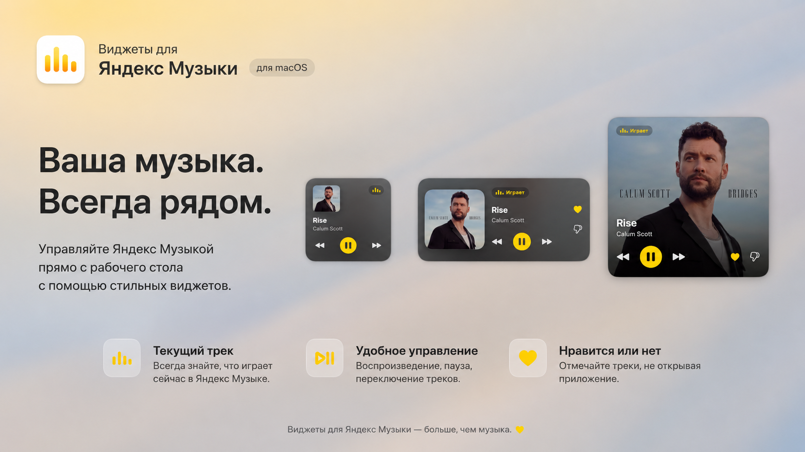
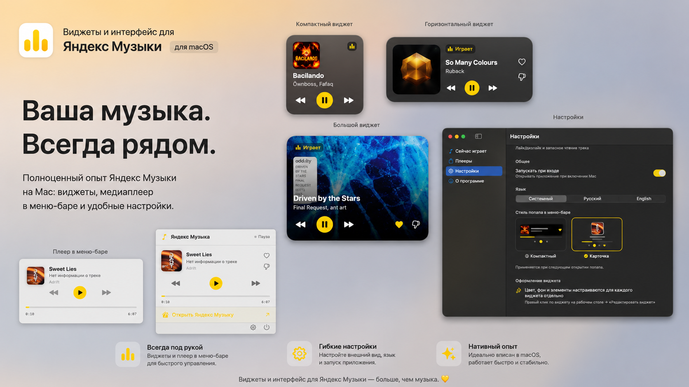

# YandexMusicDesktopWidget

Виджет рабочего стола и меню-бар-попап для macOS, показывающий текущий трек из
**Яндекс Музыки** (а также Spotify / Apple Music). Обложка в HD, лайки, управление
воспроизведением, настраиваемое оформление.

> macOS 14+ • SwiftUI • WidgetKit • без платной подписки (ad-hoc сборка)

> <p align="center">
  
  
  
</p>

---

## Возможности

- 🎵 **Виджеты 3 размеров** на рабочем столе (маленький / средний / большой)
- 🖼 **Обложка в HD** (1000×1000) через API Яндекс Музыки
- ❤️ **Лайк / дизлайк** из виджета и попапа (через API — реально проставляется в аккаунте)
- ⏯ **Управление**: плей/пауза, вперёд/назад, перемотка
- 🎨 **Оформление виджета**: акцентный цвет, фон, показ исполнителя и кнопок
- 🪟 **Меню-бар попап** в двух стилях («Компактный» и «Карточка») + полноценное окно
- 🚀 **Автозапуск** при входе в систему
- ⚡️ **Надёжное чтение трека** через `mediaremote-adapter` — работает, даже когда плеер свёрнут,
  и в обход блокировки MediaRemote начиная с macOS 15.4

---

## Установка (готовый DMG)

1. Скачайте `YandexMusicDesktopWidget-x.y.z.dmg` из [Releases](../../releases) и перетащите
   приложение в «Программы».
2. При первом запуске снимите «карантин» (приложение подписано ad-hoc, без платного Apple ID):
   ```bash
   xattr -dr com.apple.quarantine /Applications/YandexMusicDesktopWidget.app
   ```
   Затем откройте двойным кликом.
3. Выдайте разрешение **Универсальный доступ**: Системные настройки → Конфиденциальность
   и безопасность → Универсальный доступ.
4. Войдите в Яндекс (окно приложения → «Настройки») — для HD-обложек и лайков.
5. Добавьте виджет: правый клик по рабочему столу → «Изменить виджеты».

Подробнее — в [docs/INSTALL.txt](release_tools/INSTALL.txt).

---

## Структура проекта

```
YandexMusicDesktopWidget/
├── Shared/                              ← общий код приложения и виджета
│   ├── SharedModels.swift               ← TrackInfo, WidgetSettings, PendingAction
│   ├── Constants.swift                  ← плееры, bundle id, интервалы
│   └── AppGroupManager.swift            ← обмен данными через App Group (track.json и пр.)
│
├── YandexMusicDesktopWidget/            ← основное приложение
│   ├── YandexMusicDesktopWidgetApp.swift← точка входа, меню-бар, окно, AppDelegate
│   ├── ContentView.swift                ← попап меню-бара (стили «Компактный»/«Карточка»)
│   ├── MainWindowView.swift             ← окно: Сейчас играет / Плееры / Настройки / О программе
│   ├── NowPlayingService.swift          ← ядро: источник трека, виджет-перезагрузка, лайки
│   ├── NowPlayingStreamer.swift         ← событийный стрим из mediaremote-adapter
│   ├── MediaRemoteHelper.swift          ← разовое чтение Now Playing (фолбэк)
│   ├── YandexMusicAPI.swift             ← OAuth, поиск, лайки, HD-обложки
│   ├── YMTrackReader.swift              ← запасное чтение трека через Accessibility
│   ├── YMAccessibilityObserver.swift    ← наблюдение за окном ЯМ через AX
│   ├── YMActionController.swift         ← лайк/дизлайк/повтор через AX (фолбэк)
│   ├── MediaKeyController.swift         ← медиаклавиши (плей/некст/прев)
│   └── Assets / Info.plist / *.entitlements
│
├── YandexMusicDesktopWidgetExtension/   ← виджет рабочего стола (WidgetKit)
│   ├── DesktopMusicWidgetBundle.swift   ← точка входа виджета
│   ├── DesktopMusicWidget.swift         ← виды Small/Medium/Large
│   ├── WidgetProvider.swift             ← таймлайн + настройки виджета (AppIntent)
│   └── PlaybackIntents.swift            ← кнопки виджета (через App Group)
│
├── Vendor/MediaRemoteAdapter/           ← сторонний адаптер чтения Now Playing
├── release_tools/                       ← сборка DMG (ad-hoc подпись + инструкция)
└── docs/                                ← документация (архитектура, Info.plist)
```

Подробное описание каждого файла — в [docs/ARCHITECTURE.md](docs/ARCHITECTURE.md).

---

## Как это работает (кратко)

1. **Чтение трека.** `NowPlayingStreamer` держит постоянный процесс `mediaremote-adapter`
   (perl + Apple-подписанный хост) и получает события Now Playing (название, исполнитель,
   обложка, позиция, играет/пауза). Это обходит блокировку MediaRemote с macOS 15.4 и не
   требует, чтобы окно плеера было открыто.
2. **Обмен с виджетом.** `NowPlayingService` пишет трек в App Group (`track.json`), виджет
   только читает. Кнопки виджета кладут действие в App Group, приложение его исполняет.
3. **Обложки и лайки.** При входе в Яндекс `YandexMusicAPI` подтягивает HD-обложку (1000×1000)
   и проставляет лайк по `trackId` на сервере.
4. **Перезагрузка виджета.** При смене трека — мгновенный пуш + бэкапы; плюс таймлайн-«пульс»
   раз в 15с как страховка (см. [docs/ARCHITECTURE.md](docs/ARCHITECTURE.md)).

---

## Сборка из исходников

Требуется **Xcode 16+** и macOS 14+.

```bash
# Релизная сборка
xcodebuild -scheme YandexMusicDesktopWidget -configuration Release \
  -destination 'platform=macOS' -allowProvisioningUpdates \
  DEVELOPMENT_TEAM=ВАШ_TEAM_ID -derivedDataPath build/Release build

# Сборка распространяемого DMG (ad-hoc подпись + встроенный адаптер)
bash release_tools/make_release.sh 1.0.0
```

> Адаптер `Vendor/MediaRemoteAdapter` должен лежать в `Contents/Resources/MediaRemoteAdapter`
> внутри .app — `make_release.sh` копирует его автоматически.

---

## Лицензия

Код приложения — [MIT](LICENSE). Компонент `Vendor/MediaRemoteAdapter` распространяется
по своей лицензии — см. [ungive/mediaremote-adapter](https://github.com/ungive/mediaremote-adapter).
